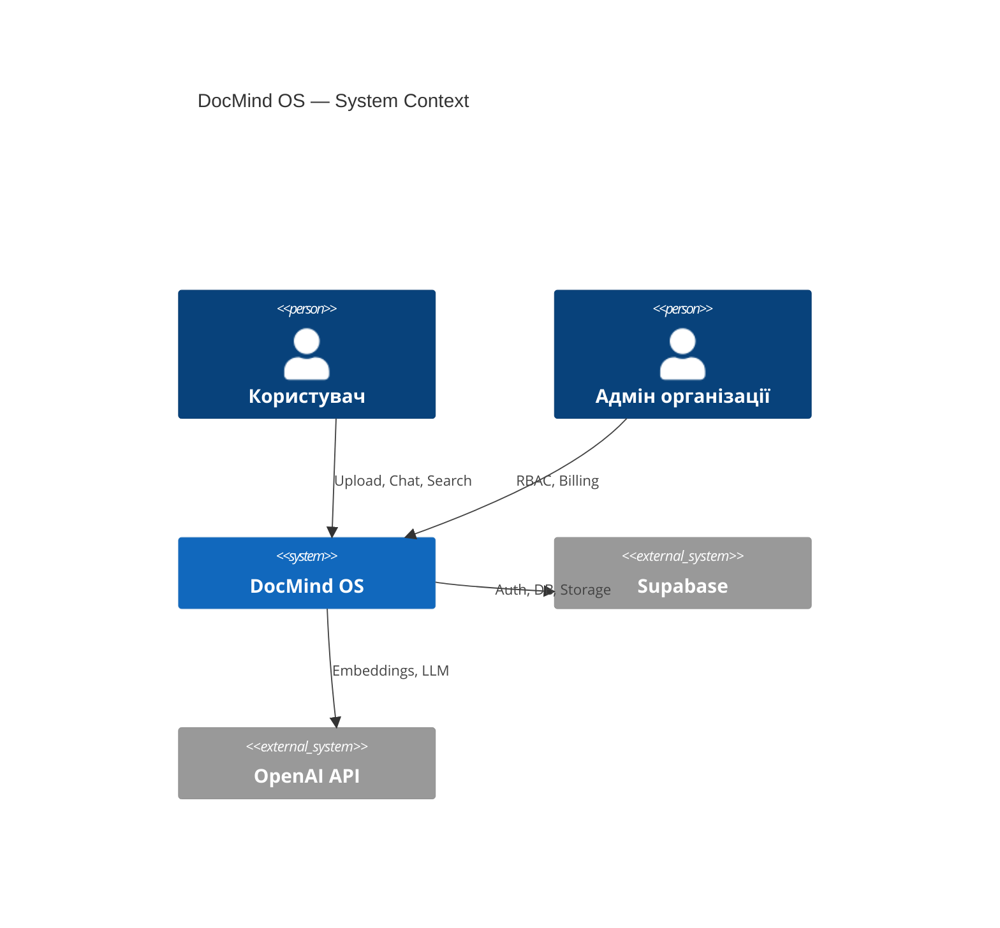
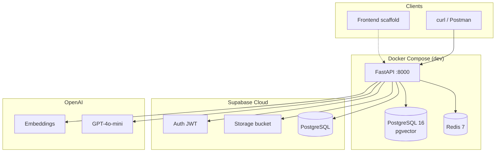
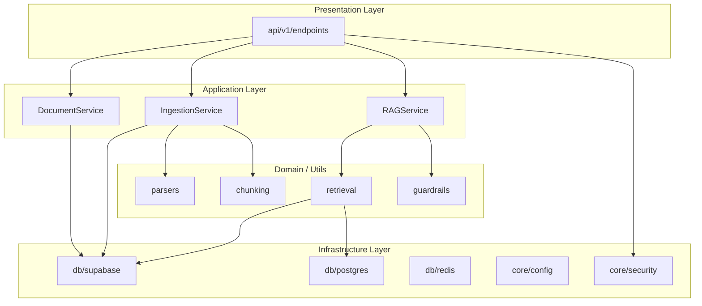
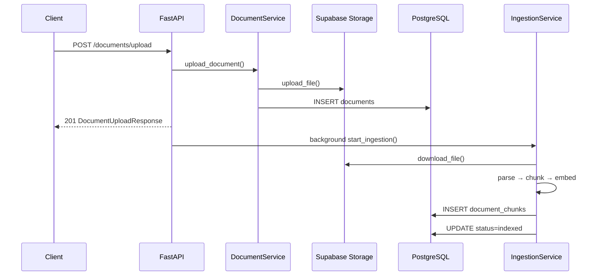
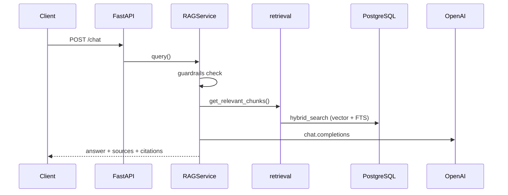
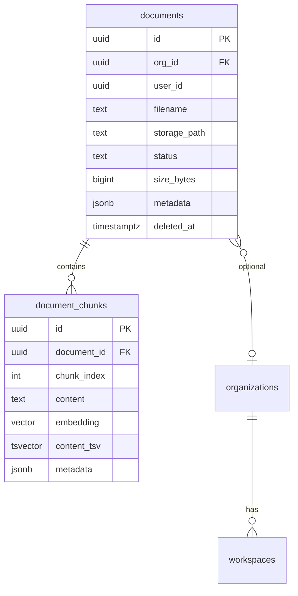

# Архітектурний паспорт проекту DocMind OS

| Поле | Значення |
|------|----------|
| **Назва** | DocMind OS (DocumentOS) |
| **Тип** | Enterprise AI Document SaaS |
| **Версія архітектури** | 1.0 (Phase 1 MVP) |
| **Дата** | Травень 2026 |
| **Статус** | ✅ Phase 1 завершено (Backend API) |
| **Репозиторій** | https://github.com/verkhobuzh-prog/docmind-os |
| **Власник документа** | Tech Lead / System Architect |

---

## 1. Призначення та бізнес-контекст

### 1.1 Місія продукту

DocMind OS — масштабована AI-платформа для роботи з корпоративними документами: завантаження, індексація, семантичний пошук і діалог (RAG) з обов'язковим цитуванням джерел.

### 1.2 Цільова аудиторія

| Роль | Потреби |
|------|---------|
| **Аналітик / юрист / ops** | Швидкий Q&A по документах, пошук фактів |
| **Org Admin** | RBAC, квоти, аудит (Phase 2+) |
| **Інтегратор** | REST API, webhooks, конектори (Phase 3+) |

### 1.3 Цілі Phase 1 (досягнуто)

- [x] Аутентифікація через Supabase JWT
- [x] Upload файлів у Storage + метадані в PostgreSQL
- [x] Ingestion: parse → chunk → embed → index
- [x] RAG Chat з citations і hybrid search
- [x] Docker-оточення для локальної розробки
- [x] Pytest suite (9/9)

---

## 2. Аналіз поточного стану

### 2.1 Зрілість компонентів

| Компонент | Статус | Зрілість |
|-----------|--------|----------|
| Backend API (FastAPI) | ✅ Реалізовано | Production-ready для MVP |
| Auth / Security | ✅ Реалізовано | MVP |
| Document Upload + Storage | ✅ Реалізовано | MVP |
| Ingestion Pipeline | ✅ Реалізовано | MVP (background tasks) |
| RAG Chat | ✅ Реалізовано | MVP |
| Frontend (React) | ⚠️ Scaffold | Phase 2 |
| Multi-tenant (orgs/workspaces) | ⚠️ DB stub | Phase 2 |
| Temporal Workers | ⚠️ Placeholder | Phase 2 |
| Billing (Stripe) | ❌ | Phase 3 |
| K8s / GitOps | 📋 Задокументовано | Phase 4 |

### 2.2 Структура репозиторію

```
docmind-os/
├── backend/                    # FastAPI — основний продукт Phase 1
│   ├── app/
│   │   ├── main.py             # Application factory, lifespan
│   │   ├── core/               # config, security, logging, exceptions
│   │   ├── db/                 # supabase, redis, postgres
│   │   ├── api/v1/endpoints/   # auth, documents, ingestion, chat
│   │   ├── services/           # document, ingestion, rag
│   │   ├── schemas/            # Pydantic DTO
│   │   ├── utils/              # parsers, chunking, embeddings, retrieval
│   │   ├── middleware/         # request ID, logging
│   │   ├── agents/             # stub (Phase 2+)
│   │   └── workflows/          # stub Temporal (Phase 2+)
│   └── tests/                  # pytest (9 tests)
├── frontend/                   # React + Vite scaffold
├── infra/supabase/migrations/  # SQL schema
├── docs/                       # Architecture, Phase 1 report
└── docker-compose.yml          # backend + postgres + redis
```

### 2.3 Ключові метрики кодової бази (Phase 1)

| Метрика | Значення |
|---------|----------|
| API endpoints | 7 (+ `/health`, `/docs`) |
| Backend modules | 6 шарів (api, services, db, core, utils, schemas) |
| SQL migrations | 2 |
| Automated tests | 9 |
| Зовнішні залежності (AI) | OpenAI (embeddings + chat) |

---

## 3. Архітектурні принципи

1. **API-first** — контракт через OpenAPI / Pydantic schemas  
2. **Security by default** — JWT на всіх захищених маршрутах, RLS-еквівалент на рівні сервісу  
3. **Async I/O** — FastAPI + `asyncio.to_thread` для sync SDK (Supabase)  
4. **Separation of concerns** — endpoints → services → db/utils  
5. **Observability-ready** — JSON logs, request ID, structured errors  
6. **Evolutionary architecture** — Phase 1 monolith API → Phase 2+ workers, event bus  

---

## 4. C4 Architecture (підсумок)

### 4.1 System Context



### 4.2 Containers (Phase 1 — фактично)



| Контейнер | Технологія | Роль Phase 1 |
|-----------|------------|--------------|
| **API** | FastAPI 0.115+ | REST, orchestration, RAG |
| **PostgreSQL** | pgvector/pg16 | Локальний hybrid search |
| **Redis** | Redis 7 | Cache (підключено, Phase 2 rate limit) |
| **Supabase** | Cloud | Auth, Storage, prod DB |
| **OpenAI** | API | Embeddings + generation |

---

## 5. Компонентна архітектура Backend

### 5.1 Шари та відповідальність



| Модуль | Файли | Відповідальність |
|--------|-------|------------------|
| **core** | `config`, `security`, `logging`, `exceptions` | Налаштування, JWT, observability |
| **db** | `supabase`, `postgres`, `redis` | Зовнішні сховища |
| **api/v1** | `auth`, `documents`, `ingestion`, `chat` | HTTP контракт |
| **services** | `document_*`, `ingestion_*`, `rag_*` | Бізнес-логіка |
| **utils** | `parsers`, `chunking`, `embeddings`, `retrieval` | AI pipeline primitives |
| **schemas** | Pydantic models | Валідація вхід/вихід |

### 5.2 Потоки даних (ключові сценарії)

#### A. Upload + Auto-Ingest



#### B. RAG Chat



---

## 6. Модель даних

### 6.1 ER-діаграма (Phase 1)



### 6.2 Таблиці

| Таблиця | Міграція | Призначення |
|---------|----------|-------------|
| `documents` | `001_documents.sql` | Метадані файлу, статус ingestion |
| `document_chunks` | `002_document_chunks.sql` | Текст + embeddings для RAG |
| `semantic_triples` | `003_knowledge_graph_metadata.sql` | Knowledge graph metadata / provenance |
| `user_profiles`, `subjects` | `004_profiles.sql` | Профілі користувача |
| `invite_codes`, `pilot_members` | `005_pilot_invites_and_catalog.sql` | Pilot invites & catalog |
| `organizations` | `002_*` | Stub для Phase 2 |
| `workspaces` | `002_*` | Stub для Phase 2 |
| `ai_request_logs` | `002_*` | Stub для observability |

### 6.3 RLS та ізоляція

- **Production (Supabase):** RLS policies на `documents` — `auth.uid() = user_id`
- **API (service role):** фільтрація `user_id` у всіх запитах DocumentService / retrieval
- **Org scope:** `org_id` + header `X-Org-ID` (optional, Phase 2 розширення)

---

## 7. API-контракт (Phase 1)

| # | Method | Endpoint | Auth | Опис |
|---|--------|----------|------|------|
| 1 | GET | `/health` | — | Health + checks |
| 2 | GET | `/api/v1/auth/me` | JWT | Профіль користувача |
| 3 | POST | `/api/v1/documents/upload` | JWT | Upload + auto-ingest |
| 4 | GET | `/api/v1/documents` | JWT | Список документів |
| 5 | GET | `/api/v1/documents/{id}` | JWT | Метадані документа |
| 6 | POST | `/api/v1/documents/{id}/ingest` | JWT | Ingestion pipeline |
| 7 | POST | `/api/v1/chat` | JWT | RAG Q&A (+ SSE) |

**Документація:** `GET /docs` (Swagger UI)

---

## 8. Технологічний стек

| Шар | Технологія | Версія / Примітка |
|-----|------------|-------------------|
| Runtime | Python | 3.12+ |
| API Framework | FastAPI | 0.115+ |
| ASGI Server | Uvicorn | standard |
| Validation | Pydantic | v2 |
| Config | pydantic-settings | .env |
| Auth | Supabase Auth | JWT |
| ORM/DB Client | Supabase SDK + asyncpg | hybrid search |
| Vector | pgvector | 1536 dims |
| Cache | Redis | 7 |
| AI Embeddings | OpenAI | text-embedding-3-large |
| AI Chat | OpenAI | gpt-4o-mini |
| PDF Parse | PyMuPDF | fitz |
| Excel | pandas + openpyxl | |
| Chunking | tiktoken | 512/64 |
| Containers | Docker Compose | dev |
| Tests | pytest + httpx | 9 tests |

---

## 9. Безпека

| Аспект | Реалізація Phase 1 | Phase 2+ |
|--------|-------------------|----------|
| Authentication | Bearer JWT (Supabase) | SSO/SAML |
| Authorization | user_id scope | RBAC + ABAC |
| Data isolation | RLS + service filters | org/workspace |
| Storage | Private bucket, signed URLs | virus scan |
| AI safety | guardrails (regex blocklist) | Llama Guard |
| Secrets | `.env`, не в git | K8s secrets / ESO |
| Dev bypass | `AUTH_DISABLED` (dev only) | заборонено в prod |

### 9.1 Загрози та мітигація (STRIDE — коротко)

| Загроза | Мітигація |
|---------|-----------|
| Spoofing | JWT validation |
| Tampering | HTTPS, signed URLs |
| Repudiation | request_id в логах (audit Phase 3) |
| Information disclosure | RLS, user-scoped queries |
| DoS | rate limit (Redis, Phase 2) |
| Elevation | service role лише на backend |

---

## 10. Нефункціональні вимоги (NFR)

| NFR | Ціль Phase 1 | Статус |
|-----|--------------|--------|
| Availability | 99% (dev/MVP) | Docker healthchecks ✅ |
| Latency (chat) | < 15s p95 | залежить від OpenAI |
| Scalability | single API instance | horizontal — Phase 2 |
| Testability | unit API tests | 9/9 ✅ |
| Observability | JSON logs + request ID | ✅ |
| Maintainability | layered modules | ✅ |

---

## 11. Розгортання

### 11.1 Development (поточне)

```bash
docker compose up --build backend postgres redis
```

| Сервіс | Порт | Healthcheck |
|--------|------|-------------|
| backend | 8000 | GET /health |
| postgres | 5432 | pg_isready |
| redis | 6379 | redis-cli ping |

### 11.2 Production (цільова — Phase 3–4)

- Kubernetes (EKS/GKE) + Helm
- Supabase Pro (managed PG)
- ArgoCD GitOps
- OpenTelemetry → Grafana

Деталі: [architecture/08-kubernetes-topology.md](./architecture/08-kubernetes-topology.md)

---

## 12. Інтеграції

| Система | Phase 1 | Майбутнє |
|---------|---------|----------|
| Supabase | ✅ Auth, Storage, DB | Edge Functions |
| OpenAI | ✅ Embeddings, Chat | Multi-model router |
| Stripe | ❌ | Phase 3 |
| Google Drive / Notion | ❌ | Phase 3 |
| Temporal | ❌ | Phase 2 |

---

## 13. Дорожня карта

| Phase | Статус | Фокус |
|-------|--------|-------|
| **Phase 1** | ✅ Done | Backend MVP |
| **Phase 2** | 🚧 Next | Frontend, multi-tenant, Temporal, rerank |
| **Phase 3** | Planned | Billing, integrations, OTel |
| **Phase 4** | Planned | LLM router, conflicts, K8s prod |

---

## 14. Обмеження та ризики

### 14.1 Known Limitations

- Немає UI (frontend — scaffold)
- Немає DOCX/PPTX parser
- Ingestion через BackgroundTasks (не Temporal)
- Reranking — простий score sort
- Service role обходить Supabase RLS (довірений backend)

### 14.2 Технічні ризики

| Ризик | Імовірність | Вплив | Мітигація |
|-------|-------------|-------|-----------|
| OpenAI rate limits | Середня | Високий | retry, fallback models (Ph.4) |
| Supabase vendor lock | Низька | Середній | стандартний PostgreSQL |
| Великі PDF | Середня | Середній | async workers, size limits |
| Витоки через prompt injection | Середня | Високий | guardrails + Phase 4 |

---

## 15. Пов'язані документи

| Документ | Опис |
|----------|------|
| [PHASE1_COMPLETION.md](./PHASE1_COMPLETION.md) | Checklist Phase 1 |
| [architecture/README.md](./architecture/README.md) | Індекс архітектури |
| [architecture/01-c4-architecture.md](./architecture/01-c4-architecture.md) | C4 детально |
| [architecture/02-ai-pipeline.md](./architecture/02-ai-pipeline.md) | AI Pipeline |
| [architecture/03-data-model.md](./architecture/03-data-model.md) | Data Model |
| [CHANGELOG.md](../CHANGELOG.md) | Історія змін |
| [README.md](../README.md) | Quick Start |

---

## 16. Історія ревізій

| Версія | Дата | Автор | Зміни |
|--------|------|-------|-------|
| 1.0 | 2026-05 | System Architect | Початковий паспорт після Phase 1 |

---

*Документ є єдиним джерелом архітектурної правди (architecture single source of truth) для DocMind OS на момент завершення Phase 1 MVP.*
