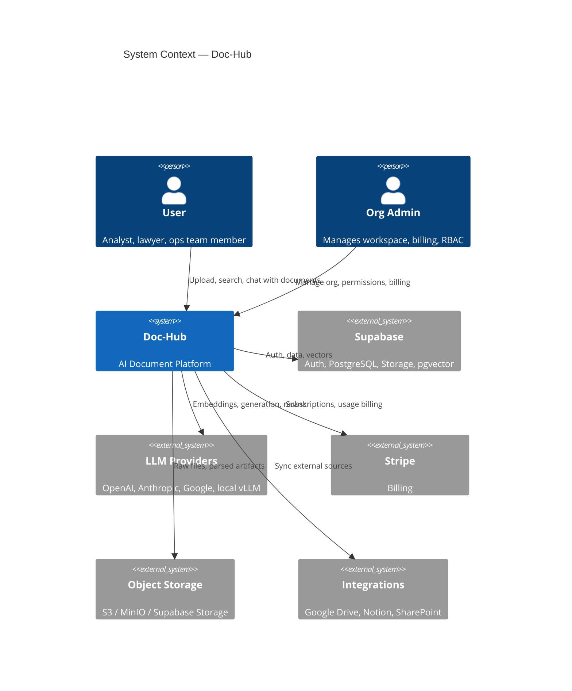
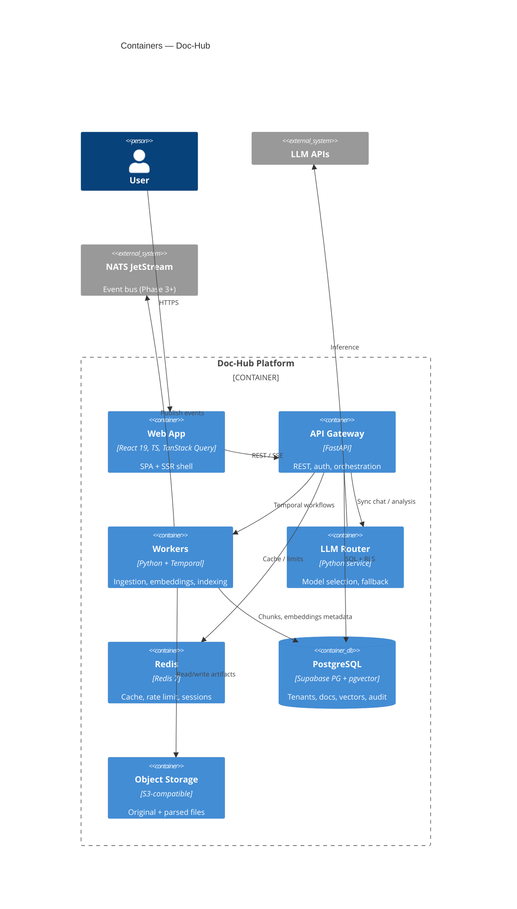
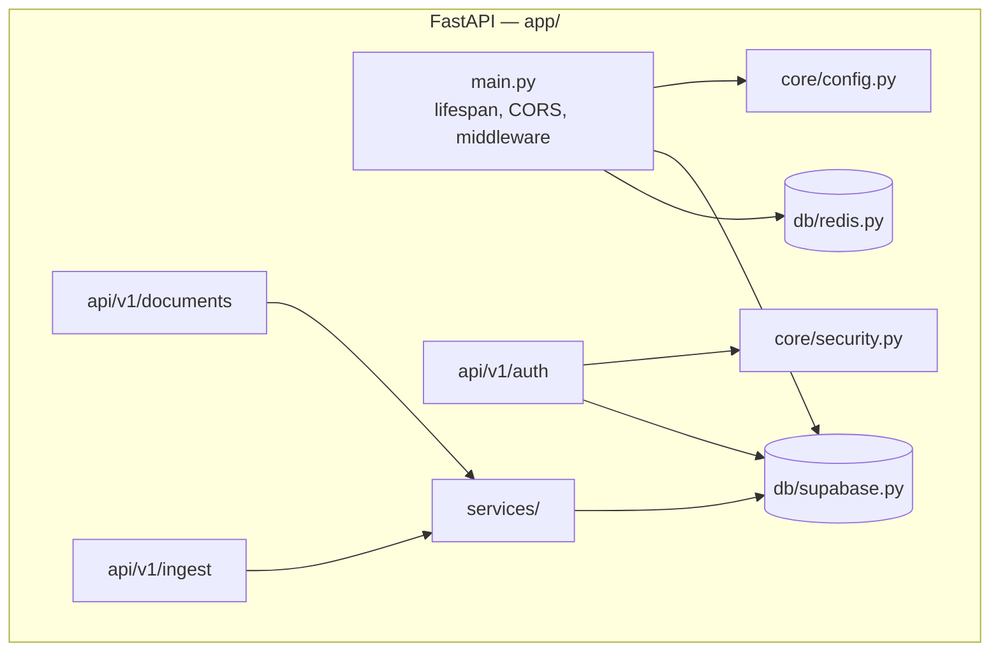

# C4 Architecture — Doc-Hub

## Level 1: System Context

| Actor | Interaction |
|-------|-------------|
| **End User** | Upload docs, semantic search, RAG chat, view insights |
| **Org Admin** | RBAC, workspaces, quotas, audit, conflict resolution |
| **System Integrator** | REST API, webhooks, OAuth connectors |

---

## Level 2: Containers

| Container | Responsibility | Phase |
|-----------|----------------|-------|
| **Web App** | UI, auth client, real-time status | 1 |
| **API Gateway** | AuthZ, CRUD, job triggers, chat API | 1 |
| **Workers** | Parse, chunk, embed, index | 1–2 |
| **LLM Router** | Model routing, cost caps, fallback | 4 |
| **Redis** | Rate limiting, job status cache | 1 |
| **PostgreSQL** | Source of truth + pgvector | 1 |
| **Object Storage** | Binary documents | 1 |
| **NATS/Kafka** | Domain events, decoupling | 3 |

---

## Level 3: API Component (Phase 1 focus)

---

## Deployment Views

| Environment | Topology |
|-------------|----------|
| **Dev** | Docker Compose: api + postgres + redis + minio |
| **Staging** | K8s single cluster, Supabase cloud, managed Redis |
| **Prod** | K8s multi-AZ, Supabase Pro, dedicated workers pool, CDN |
