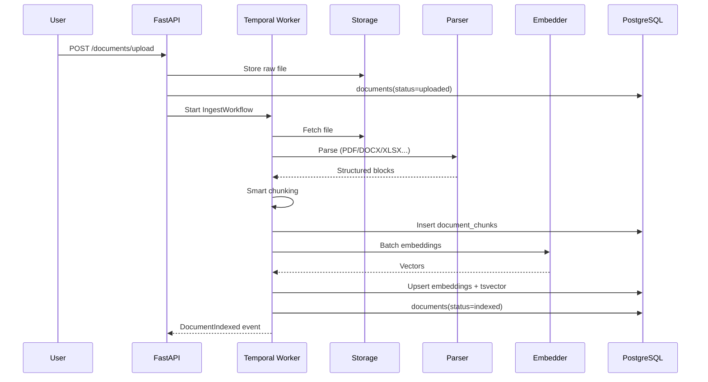

# AI Pipeline — DocMind OS

## End-to-end flow

```
Upload → Virus Scan → Parse → Chunk → Enrich → Embed → Index → RAG Query → Generate → Guardrails → Response
```

---

## Phase 1 (MVP) — Implemented scope

| Stage | Technology | Output |
|-------|------------|--------|
| **Upload** | Supabase Storage + signed URL | `documents` row, `storage_path` |
| **Virus scan** | ClamAV sidecar (Phase 1.5) | `scan_status: clean\|infected` |
| **Parse** | Unstructured.io / LlamaParse | `parsed_text`, `pages[]` |
| **Chunk** | LangChain RecursiveCharacter + table-aware splitter | `document_chunks` rows |
| **Embed** | OpenAI `text-embedding-3-large` or Voyage-3 | `embedding vector(1536)` |
| **Index** | pgvector HNSW + GIN full-text | Hybrid-ready index |
| **Retrieve** | pgvector cosine + BM25 (`tsvector`) | Top-K chunks |
| **Generate** | GPT-4o-mini / Claude Haiku via instructor | Structured answer + citations |
| **Guardrails** | Llama Guard 3 / regex PII | Filtered output |

---

## Ingestion Pipeline (detailed)



### Parsing strategy by MIME

| Type | Primary | Fallback |
|------|---------|----------|
| PDF | LlamaParse | Unstructured hi_res |
| DOCX/PPTX | Unstructured | python-docx |
| XLSX | Unstructured tables | pandas |
| Images | GPT-4o Vision OCR | Tesseract |
| MD/TXT | Direct | — |

### Chunking rules

```python
# Semantic boundaries: headings, slides, sheet tabs
CHUNK_SIZE = 512          # tokens
CHUNK_OVERLAP = 64
TABLE_CHUNK = "preserve"  # never split mid-table
SLIDE_CHUNK = "per_slide" # PPTX
```

---

## RAG 2.0 Retrieval (Phase 2+)

```
Query → Rewrite (LLM) → Multi-query (3 variants)
      → Hybrid retrieval (vector + BM25 + metadata filters + RBAC)
      → Rerank (Cohere Rerank 3.5)
      → Context compression (LLMLingua)
      → Faithfulness pre-check
      → Generation with citation enforcement
      → Post-hoc faithfulness score
```

| Step | Tech | Latency budget |
|------|------|----------------|
| Query rewrite | Haiku / GPT-4o-mini | 200ms |
| Vector search | pgvector HNSW, top-50 | 50ms |
| BM25 | PostgreSQL `ts_rank` | 30ms |
| Rerank | Cohere Rerank | 150ms |
| Generate | Router-selected model | 2–8s |

---

## LLM Router (Phase 4)

```python
class RouterDecision(BaseModel):
    model: str           # gpt-4o | claude-sonnet | grok-2
    reason: str
    estimated_cost_usd: float
    fallback_chain: list[str]
```

Inputs: `task_type`, `org_tier`, `privacy_level`, `budget_remaining`, `p95_latency_sla`.

---

## Event catalog (AI domain)

| Event | Payload | Consumer |
|-------|---------|----------|
| `DocumentUploaded` | doc_id, org_id, mime | Ingestion Agent |
| `DocumentParsed` | doc_id, page_count | Chunking Agent |
| `ChunksCreated` | doc_id, chunk_count | Embedding Agent |
| `EmbeddingsGenerated` | doc_id, model, tokens | Index Agent |
| `QueryExecuted` | query_id, faithfulness | Observability Agent |
| `CostThresholdReached` | org_id, threshold | Billing Agent |
