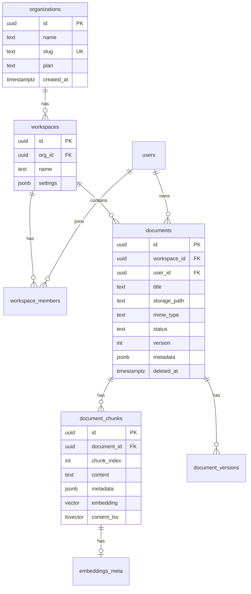

# Data Model — Doc-Hub

## ERD (Phase 1–2 core)



---

## Phase 1 tables (SQL)

See `infra/supabase/migrations/001_phase1_core.sql`.

### `documents` (MVP)

| Column | Type | Notes |
|--------|------|-------|
| id | uuid PK | |
| workspace_id | uuid FK | nullable Phase 1 |
| user_id | uuid FK | auth.users |
| title | text | |
| storage_path | text | Supabase Storage key |
| mime_type | text | |
| status | enum | uploaded, parsing, indexed, failed |
| content | text | parsed plain text (MVP) |
| metadata | jsonb | pages, language, etc. |
| version | int | optimistic locking |
| created_at | timestamptz | |
| updated_at | timestamptz | |
| deleted_at | timestamptz | soft delete |

### `document_chunks` (Phase 1.5)

| Column | Type |
|--------|------|
| id | uuid |
| document_id | uuid FK |
| chunk_index | int |
| content | text |
| embedding | vector(1536) |
| content_tsv | tsvector |
| metadata | jsonb |

---

## RLS policies (mandatory pattern)

Every tenant table **must** filter by `org_id` via workspace join:

```sql
-- Example: documents SELECT
create policy "documents_select"
on public.documents for select
using (
  deleted_at is null
  and (
    user_id = auth.uid()
    or exists (
      select 1 from workspace_members wm
      join workspaces w on w.id = wm.workspace_id
      where wm.user_id = auth.uid()
        and w.id = documents.workspace_id
        and wm.role in ('owner', 'admin', 'member', 'viewer')
    )
  )
);
```

### Service role bypass

Backend workers use `SUPABASE_SERVICE_ROLE_KEY` only inside trusted workers, never exposed to client.

---

## Indexes

```sql
create index documents_workspace_status_idx on documents (workspace_id, status) where deleted_at is null;
create index chunks_document_idx on document_chunks (document_id, chunk_index);
create index chunks_embedding_idx on document_chunks using hnsw (embedding vector_cosine_ops);
create index chunks_fts_idx on document_chunks using gin (content_tsv);
```
