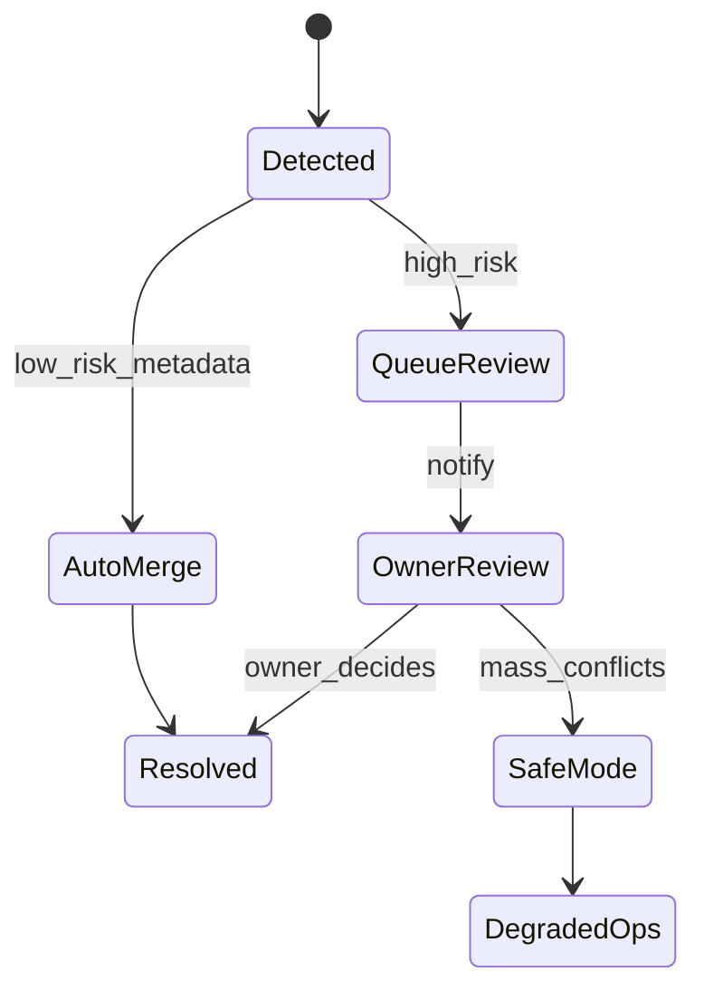

# Conflict Management — DocMind OS

## Conflict types

| Type | Example | Detection |
|------|---------|-----------|
| **Document version** | Two users edit metadata simultaneously | `version` mismatch on UPDATE |
| **Permission** | Admin revokes access while user chats | Stale JWT + RLS deny |
| **AI action** | Agent updates doc while user edits | Optimistic lock + agent queue |
| **Billing** | Plan downgrade mid-ingestion | Quota check before workflow step |

---

## Optimistic locking

```sql
update documents
set title = $1, version = version + 1, updated_at = now()
where id = $2 and version = $3 and deleted_at is null
returning *;
-- 0 rows → ConflictDetected
```

API response `409 Conflict`:

```json
{
  "error": "version_conflict",
  "current_version": 4,
  "your_version": 3,
  "resolution": ["merge", "overwrite", "discard"]
}
```

---

## Conflict Resolver Agent (Phase 4)



| Risk | Auto-resolve? | Action |
|------|---------------|--------|
| Title typo vs title typo | Yes | Last-write-wins with audit |
| Content + content | No | Owner/Admin UI diff |
| Permission change | No | Revoke session, notify |
| AI + human edit | No | Pause agent, notify |

---

## Safe Mode

Triggered when: `conflict_rate > threshold` OR `llm_error_rate > 5%` OR manual.

- Disable AI write actions
- Read-only search + chat (cached)
- Queue ingestion
- Alert PagerDuty + org owners

---

## Audit trail (immutable)

```sql
create table audit_events (
  id uuid primary key default gen_random_uuid(),
  org_id uuid not null,
  actor_id uuid,
  actor_type text, -- user | system | ai_agent
  action text not null,
  resource_type text,
  resource_id uuid,
  payload jsonb,
  ip inet,
  created_at timestamptz default now()
);
-- append-only: no UPDATE/DELETE policies
```
