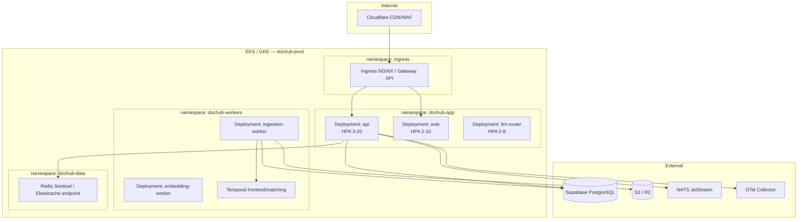

# Kubernetes Topology — Doc-Hub (Production)

## Cluster layout



---

## Helm chart structure

```
infra/helm/dochub/
├── Chart.yaml
├── values.yaml
├── values-staging.yaml
├── values-prod.yaml
└── templates/
    ├── deployment-api.yaml
    ├── deployment-web.yaml
    ├── deployment-workers.yaml
    ├── service.yaml
    ├── ingress.yaml
    ├── hpa.yaml
    ├── configmap.yaml
    ├── secret.yaml          # External Secrets Operator
    ├── pdb.yaml
    └── networkpolicy.yaml
```

---

## Resource sizing (prod baseline)

| Workload | Replicas | CPU | Memory |
|----------|----------|-----|--------|
| api | 3–20 (HPA) | 500m–2 | 1–4Gi |
| web | 2–10 | 250m–1 | 512Mi–2Gi |
| ingestion-worker | 2–50 (KEDA) | 1–4 | 2–8Gi |
| llm-router | 2–8 | 500m–2 | 1–2Gi |

**KEDA triggers:** NATS queue depth, Temporal task backlog.

---

## GitOps (ArgoCD)

```
apps/
├── dochub-api      → infra/helm/dochub (path: api)
├── dochub-web      → infra/helm/dochub (path: web)
└── dochub-workers  → infra/helm/dochub (path: workers)
```

Secrets: AWS Secrets Manager → External Secrets → K8s Secret.

---

## Network policies

- `api` → Supabase IP allowlist + Redis + NATS only
- `workers` → S3 + Supabase + LLM APIs (egress proxy optional)
- `web` → CDN only, no direct DB
